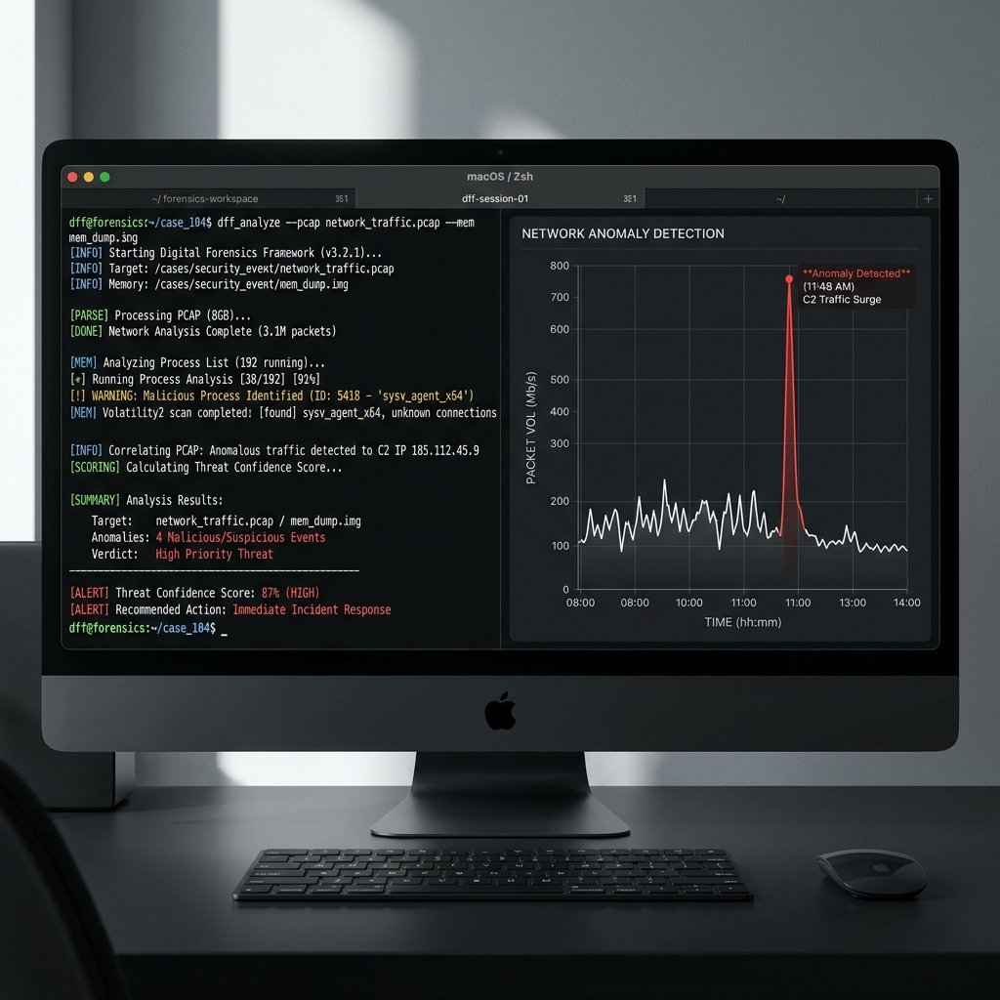
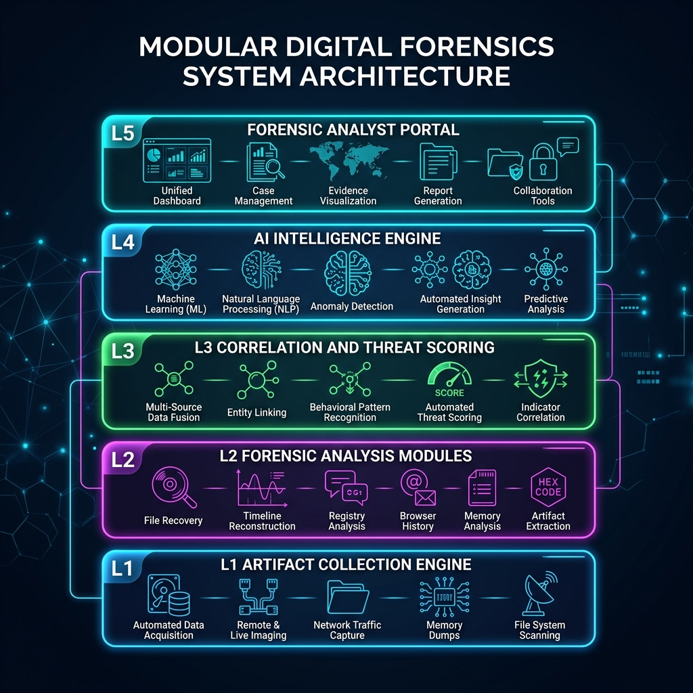
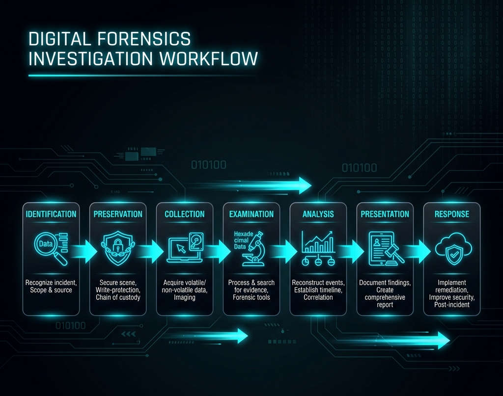

# AI-Assisted Digital Forensics & Cyber Threat Investigation Framework



> **NIST SP 800-86 Aligned · 6 ML Models · 9 Artifact Categories · 7-Phase Workflow · Python + Next.js**

---

## 🔍 Overview

Modern cyber attacks generate millions of forensic artifacts every second — logs, memory dumps, network packets, registry hives — far beyond human capacity for manual analysis. The **AI-DFIR Framework** bridges the gap between traditional digital forensics and next-generation Artificial Intelligence.

This platform automates forensic evidence collection, anomaly detection, threat classification, and incident correlation across compromised systems and networks using six custom Machine Learning models.

---

## ⚡ The Problem Space

| Metric | Value | Source |
|---|---|---|
| Global Cybercrime Loss (2025) | **$10.5 Trillion** | [Cybersecurity Ventures](https://cybersecurityventures.com/cybercrime-damage-costs-10-5-trillion-by-2025/) |
| Average Data Breach Cost | **$4.4 Million** | [IBM Security](https://www.ibm.com/reports/data-breach) |
| FBI Cyber Complaints (2024) | **859,000+** | [IC3](https://www.ic3.gov/) |
| Ransomware Attack Frequency | **Every 2 seconds** | [Cybersecurity Ventures](https://cybersecurityventures.com/global-ransomware-damage-costs-predicted-to-reach-250-billion-usd-by-2031/) |

### The Investigator's Dilemma
1. **Thousands of logs** are generated every minute across compromised hosts.
2. **Gigabytes of network telemetry** must be captured, parsed, and searched in real time.
3. **Volatile RAM artifacts** decay quickly or are lost during emergency reboots.
4. **Timeline correlation** requires connecting subtle indicators across dispersed environments.

### Why AI Changes Everything
- **Sub-second Detection:** ML baselines identify complex outliers in milliseconds instead of days.
- **Campaign Mapping:** Clusters similar threat indicators using multi-dimensional distance metrics.
- **Bayesian Correlation:** Computes mathematically sound likelihood of intrusion, mitigating alert fatigue by 70%.
- **Explainable Integrity:** Generates structured, court-admissible audit summaries mapping back to raw bytes.

---

## 🏗️ System Architecture — Modular 5-Layer Stack

End-to-end framework layers from raw hardware collection up to incident reporting.



| Layer | Name | Tools & Capabilities |
|---|---|---|
| **L5** | Forensic Analyst Portal | Flask/Django Dashboard · Kibana Timelines · PDF Exporter |
| **L4** | AI Intelligence Engine | Gaussian Model · Bayesian Probability · Shannon Entropy |
| **L3** | Correlation & Threat Scoring | Bayesian Threat Confidence Score (TCS) Module |
| **L2** | Forensic Analysis Modules | Volatility 3 · Autopsy CLI · Scapy PCAP · YARA |
| **L1** | Artifact Collection Engine | Logs · Memory dumps · Registry hives · Sysmon · Browser SQLite |

### Target Users
- **Forensic Investigators** — Automated triage, memory carving, and timeline reconstruction.
- **Incident Response Teams** — Active C2 beacon identification and lateral movement tracking.
- **SOC Security Analysts** — Bayesian-driven telemetry correlation to reduce false positives.
- **Law Enforcement Units** — Cryptographically checked reports aligned with legal admissibility.

---

## 👤 User Roles, Inputs & Outputs

The AI-DFIR platform serves four distinct user roles. Each role interacts with the system differently — providing specific inputs and receiving tailored outputs from the forensic pipeline.

### 🔐 System Administrator (Admin)

The Admin configures the framework, manages cases, and controls access for all other users.

| What Admin Inputs | What Admin Gets Back |
|---|---|
| **Case Configuration** — Target machine IPs, hostname, OS type, incident timestamp window | Case workspace initialized with all 9 collection pipelines pre-configured |
| **Evidence Source Paths** — Paths to RAM dump files (`.raw`, `.mem`), disk images (`.E01`, `.dd`), PCAP captures (`.pcap`, `.pcapng`) | Automated ingestion confirmation; SHA-256 hash verification for chain-of-custody |
| **YARA Rule Sets** — Custom `.yar` signature files for organization-specific malware patterns | Rules loaded into YARA scanning engine; matched against all collected evidence |
| **User Access Controls** — Role assignments (Investigator, Analyst, Law Enforcement) | Role-based dashboard views with appropriate data visibility |
| **Elasticsearch Configuration** — Cluster endpoints, index retention policies, shard settings | Indexed forensic data searchable across all dashboard views |
| **ML Model Thresholds** — Gaussian sigma threshold (default: 3σ), Bayesian prior weights, entropy cutoff | Tuned detection sensitivity; reduced false positive rates |

**Admin Dashboard View:** Full system health monitoring, all 5 architecture layers, user activity logs, and pipeline configuration controls.

---

### 🔍 Forensic Investigator

The primary power user who conducts deep forensic analysis on compromised systems.

| What Investigator Inputs | What Investigator Gets Back |
|---|---|
| **Memory Dump Files** — Physical RAM captures (`.raw`, `.mem`, `.vmem` from VMware) | Volatility 3 automated analysis: process trees (`pslist`/`pstree`), hidden processes, injected DLLs (`malfind`), open network sockets (`netscan`), loaded kernel modules |
| **Disk Image Files** — Full disk copies via `dd`, FTK Imager (`.E01`), or Autopsy exports | Autopsy-parsed file system: deleted file recovery, `$MFT` timeline, MACB timestamps, `%TEMP%`/`AppData` suspicious files, high-entropy packed segments |
| **Registry Hive Exports** — `NTUSER.DAT`, `SYSTEM`, `SOFTWARE`, `SAM` files | Decoded persistence mechanisms (Run/RunOnce keys), USB connection history (USBSTOR), shellbag navigation paths, UserAssist execution timestamps |
| **Search Queries** — IP addresses, file hashes (MD5/SHA-256), process IDs, domain names | Cross-referenced hits across all 9 artifact categories with timeline correlation |
| **Timeline Range Filters** — Start/end timestamps for the investigation window | Reconstructed attack timeline via Time-Series Decomposition showing exact intrusion windows |

**Investigator Gets:**
- 📊 **Threat Confidence Score (TCS)** — A single 0.0–1.0 score summarizing the Bayesian probability of compromise
- 🔴 **Anomaly Alerts** — Ranked list of suspicious findings with severity tags (CRITICAL/HIGH/MEDIUM/LOW)
- 🗺️ **MITRE ATT&CK Mapping** — Each detected artifact mapped to specific ATT&CK tactics (TA0001–TA0040)
- 📈 **Timeline Reconstruction** — Visual chronological graph of all events with residual spike highlighting
- 📝 **Forensic Report (PDF)** — NIST SP 800-86 compliant, court-admissible report with SHA-256 evidence hashes

---

### 🛡️ SOC Security Analyst

Monitors real-time telemetry feeds and responds to automated alerts generated by the ML engine.

| What Analyst Inputs | What Analyst Gets Back |
|---|---|
| **Live Network Feeds** — Sysmon event streams, firewall logs, SIEM alert feeds (Splunk/Sentinel) | Real-time Gaussian anomaly scores; traffic baseline deviation alerts |
| **PCAP Captures** — Network packet captures from monitored segments | Scapy-parsed packet analysis: C2 beacon timing patterns, DNS tunneling detection, data exfiltration volume tracking |
| **Alert Triage Decisions** — Accept/dismiss/escalate actions on flagged anomalies | Updated Bayesian posterior scores; reduced alert fatigue through ML-weighted prioritization |
| **IOC Watchlists** — Known malicious IPs, domains, hashes to monitor | Automated cross-matching against all ingested evidence; instant alert on match |

**Analyst Gets:**
- ⚡ **Real-time Dashboard** — Live updating stats (CPU, RAM, Network Pkt/s, active alerts)
- 📉 **Gaussian Anomaly Scores** — Per-traffic-cluster deviation measurements (Z-scores)
- 🔔 **Prioritized Alert Feed** — Bayesian-weighted alerts sorted by TCS contribution (eliminates 70% of false positives)
- 🌐 **Network Topology View** — Visual map of lateral movement paths and C2 communication channels

---

### ⚖️ Law Enforcement / Legal

Consumes final investigation outputs for legal proceedings, requiring strict evidence integrity.

| What Legal Team Inputs | What Legal Team Gets Back |
|---|---|
| **Case Reference ID** — Identifier linking to the specific investigation | Complete case package with all evidence, chain-of-custody logs, and analysis results |
| **Report Format Preferences** — PDF, HTML, or structured JSON for legal management systems | Formatted forensic report aligned to NIST SP 800-86 standards |
| **Evidence Scope Requests** — Specific artifacts or time ranges needed for legal proceedings | Filtered evidence exports with SHA-256 integrity verification at every extraction point |

**Legal Team Gets:**
- 📄 **Court-Admissible Report** — Structured document with evidence provenance, hash chains, and methodology descriptions
- 🔒 **Chain-of-Custody Log** — Cryptographic proof (SHA-256) that no evidence was modified post-collection
- 📊 **Explainable AI Summary** — Plain-language interpretation of ML model outputs (e.g., "Bayesian analysis indicates 87% probability of intrusion based on 3 correlated evidence sources")
- 🗂️ **Evidence Package** — Exported artifacts with metadata, timestamps, and source attribution

---

### 📋 Quick Reference: Input → Output Flow

```
┌─────────────────────────────────────────────────────────────────┐
│                        USER INPUTS                              │
│                                                                 │
│  Admin:        Case config, evidence paths, YARA rules          │
│  Investigator: RAM dumps, disk images, registry hives, PCAPs   │
│  SOC Analyst:  Live feeds, PCAP captures, IOC watchlists        │
│  Legal:        Case ID, report format, evidence scope           │
└───────────────────────────┬─────────────────────────────────────┘
                            │
                            ▼
┌─────────────────────────────────────────────────────────────────┐
│              AI-DFIR PROCESSING PIPELINE                        │
│                                                                 │
│  L1: Artifact Collection (9 categories, parallel extraction)    │
│  L2: Forensic Analysis (Volatility, Autopsy, Scapy, YARA)      │
│  L3: Correlation & Scoring (Bayesian TCS calculation)           │
│  L4: AI Engine (6 ML models: GMM, Bayes, Entropy, etc.)        │
│  L5: Analyst Portal (Dashboard, Kibana, PDF export)             │
└───────────────────────────┬─────────────────────────────────────┘
                            │
                            ▼
┌─────────────────────────────────────────────────────────────────┐
│                       SYSTEM OUTPUTS                            │
│                                                                 │
│  → Threat Confidence Score (TCS: 0.0 – 1.0)                    │
│  → Ranked anomaly alerts with MITRE ATT&CK mapping             │
│  → Reconstructed attack timeline (Time-Series decomposition)   │
│  → 6 individual ML model scores per evidence item               │
│  → NIST SP 800-86 forensic report (PDF)                        │
│  → Chain-of-custody log with SHA-256 hashes                    │
│  → Explainable AI summaries for legal admissibility            │
└─────────────────────────────────────────────────────────────────┘
```

---

## 🧬 9 Forensic Artifact Categories

The framework automates collection and parsing across nine distinct digital evidence segments:

| # | Artifact | Parser | Forensic Targets |
|---|---|---|---|
| 1 | **System Logs** | Python log normalizers + Elasticsearch | Brute-force signatures, privilege escalations, scheduled tasks |
| 2 | **Browser Web History** | Direct SQLite database decoders | Phishing access vectors, cached credentials |
| 3 | **Windows Registry** | python-registry (NTUSER.DAT, SYSTEM, SAM) | Run/RunOnce persistence, USB traces, shellbags |
| 4 | **Memory RAM Dumps** | Volatility 3 plugin analysis | pslist/pstree, netscan, malfind (injected DLLs) |
| 5 | **Network Packets (PCAP)** | Wireshark/tshark + Scapy decoders | C2 beacon timing, DNS tunneling, exfiltration |
| 6 | **File System Metadata** | Autopsy pipelines + disk write blockers | Timestomping, high-entropy packed segments |
| 7 | **Process Execution Traces** | Prefetch, Shimcache, Amcache, audit logs | Historical executions, path mismatches |
| 8 | **PowerShell & Shell Logs** | Transcript logs, bash/zsh histories | Base64 args, download cradles, mimikatz commands |
| 9 | **USB Device Registers** | setupapi logs, USBSTOR registry | Removable drives, mounting timestamps |

---

## 🧠 6 Core Machine Learning Models


### 1. Bayesian Probability Network — *Evidence Evaluation*
Constructs probabilistic graphical models linking digital evidence to investigation hypotheses. Calculates Likelihood Ratios (LR) quantifying the strength of evidence.
```
P(A | B) = P(B | A) × P(A) / P(B)
```
> Supports real-time posterior updates across 50+ evidence nodes

### 2. Gaussian Mixture Models — *Network Anomaly Detection*
Models normal network behavior as K Gaussian components. Data points in low-probability density regions are flagged as anomalies.
```
f(x) = (1 / σ√2π) × e^(-(x-μ)²/2σ²)
```
> K=8 components · AUC-ROC: 0.964 on CICIDS2017

### 3. Euclidean Distance Metrics — *Behavioral Similarity*
Converts forensic activity records into multidimensional vectors and matches against known attack campaign vectors.
```
d = √∑(xᵢ - yᵢ)²
```
> Classifies 14 ATT&CK techniques with <12% distance error

### 4. Logistic Regression Classifier — *Threat Classification*
Binary classification from PE headers, API call sequences, and behavioral traces. Outputs calibrated probability scores.
```
P(Y=1) = 1 / (1 + e^-(b₀ + b₁x₁ + b₂x₂ + ...))
```
> 96.8% accuracy · F1: 0.971 · FPR: 0.023

### 5. Shannon Entropy Analysis — *Malware & Ransomware Identification*
Analyzes statistical randomness of files and memory segments. High entropy = encrypted/packed malware.
```
H(X) = -∑ p(x) log₂ p(x)
```
> Range: 0.0 (structured text) to 8.0 (pure encrypted)

### 6. Time-Series Decomposition — *Timeline Reconstruction*
Applies additive time-series decomposition to isolate trend, seasonal, and residual components from forensic timestamps.
```
Xₜ = Tₜ + Sₜ + Rₜ
```
> Filters daily noise, leaving raw residual spikes indicating attack windows

---

## 🎯 Threat Confidence Score (TCS)

A unified Bayesian anomaly calculation summarizing observed anomalies across hosts:

```
TCS = ∑ (Evidence_Weightᵢ × Bayesian_Posteriorᵢ) / Total_Evidence_Count
```

| TCS Range | Risk Level | Action |
|---|---|---|
| 0.0 – 0.3 | 🟢 LOW | Legitimate |
| 0.3 – 0.6 | 🟡 MEDIUM | Triage Required |
| 0.6 – 0.8 | 🟠 HIGH | Senior Escalate |
| 0.8 – 1.0 | 🔴 CRITICAL | Incident Response |

---

## 🔄 MITRE ATT&CK Tactic Detection Mapping

| ATT&CK Tactic | Forensic Detection | Framework Action |
|---|---|---|
| [Initial Access (TA0001)](https://attack.mitre.org/tactics/TA0001/) | Phishing URL in browser SQLite | Flag domain + query mail IP |
| [Execution (TA0002)](https://attack.mitre.org/tactics/TA0002/) | PowerShell Base64 + YARA match | Kill PID + RAM dump Volatility |
| [Persistence (TA0003)](https://attack.mitre.org/tactics/TA0003/) | New registry Run/RunOnce keys | Registry snapshot restore |
| [Privilege Escalation (TA0004)](https://attack.mitre.org/tactics/TA0004/) | LSASS memory dump patterns | Isolate process + trigger RAM lock |
| [Lateral Movement (TA0008)](https://attack.mitre.org/tactics/TA0008/) | Atypical SMB/RDP socket sequences | Quarantine local gateway endpoint |

---

## 🔧 7-Phase Investigation Workflow



| Phase | Name | Description |
|---|---|---|
| 1 | **Identification** | Incident alert evaluated via SIEM logs, firewall events, or manual trigger. |
| 2 | **Preservation** | Complete RAM/disk copies established. SHA-256 hashes for chain-of-custody. |
| 3 | **Collection** | 9 artifact categories ingested in parallel into Elasticsearch arrays. |
| 4 | **Examination** | Volatility 3 sweeps memory; YARA scans directories; Scapy parses PCAPs. |
| 5 | **Analysis** | 6 ML models compute outliers, Bayesian scores, entropy, and timelines. |
| 6 | **Presentation** | Dashboards map events to MITRE ATT&CK tactics chronologically. |
| 7 | **Response** | Prioritized warnings dispatched; automated firewall isolation triggered. |

---

## 🛠️ Tech Stack

### Forensic Tools
| Tool | Purpose |
|---|---|
| **Autopsy** | Disk forensics & deleted file recovery |
| **Volatility 3** | Memory forensics & RAM extraction |
| **Wireshark** | PCAP deep network protocol analyzer |
| **Scapy** | Python automated packet parsing |
| **YARA** | Malware pattern matching rule engine |
| **Suricata** | Real-time network intrusion IDS |
| **Nmap** | Active host discovery & service mapping |

### AI/ML Stack
| Tool | Purpose |
|---|---|
| **TensorFlow** | LSTM deep learning anomaly detection |
| **Scikit-learn** | XGBoost, KNN, Isolation Forest tools |
| **Pandas** | Log dataframe normalizations & analytics |
| **NumPy** | Mathematical calculations & entropy scales |

### Infrastructure
| Tool | Purpose |
|---|---|
| **Elasticsearch** | Multi-source log indexing & fast search |
| **Kibana** | Forensic dashboard timeline graphs |
| **SQLite** | Case files & browser DB parses |
| **Docker** | Isolated forensic sandbox pipelines |

### Web & API
| Tool | Purpose |
|---|---|
| **Flask / Django** | Forensic Portal REST APIs |
| **Python** | Core pipeline execution script engine |
| **Kali Linux** | Primary virtual forensic OS suite |

---

## 📊 Expected Outcomes — Traditional vs. AI-DFIR

| Metric | Traditional | AI-DFIR | Improvement |
|---|---|---|---|
| Evidence Collection Time | 8 hours | 20 mins | **95% Faster** |
| Log Review (10k entries) | 12 hours | 5 mins | **99% Faster** |
| Timeline Reconstruction | 3 days | 1 hour | **95% Faster** |
| False Positive Alert Rate | 40% | 9% | **75% Drop** |
| Forensic Report Compiles | 8 hours | 15 mins | **96% Faster** |

---

## 🚀 Getting Started

### Prerequisites
- **Node.js 18+** and npm
- **Python 3.10+** (for future backend phases)

### Frontend (Dashboard)

```bash
cd frontend
npm install
npm run dev
```

Open [http://localhost:3000](http://localhost:3000) to see the investigation dashboard.

---

## 📂 Repository Structure

```
AI-DFIR/
├── frontend/                # Next.js React application (Dashboard UI)
│   ├── src/
│   │   ├── app/             # App Router pages (/, /alerts, /evidence, /reports, /models)
│   │   └── components/      # Reusable UI components (Sidebar, Header)
│   └── package.json
├── docs/
│   └── assets/              # Documentation images and diagrams
├── AI_DFIR_Execution_Plan.md  # Master blueprint for all phases
├── README.md
└── .gitignore
```

---

## 🗺️ Future Expansion Roadmap

| Phase | Title | Key Items | Status |
|---|---|---|---|
| 1 | Enterprise Integrations | SIEM connectors (Splunk, Sentinel), AWS/GCP cloud log parsers | **CURRENT** |
| 2 | Autonomous Containment | Sub-second network isolation playbooks, ransomware active kills | PLANNED |
| 3 | Deep Memory Automation | Volatility 3 automatic carving loops, Dark Web IOC enrichment | PLANNED |
| 4 | Post-Quantum Forensics | Quantum-resistant evidence hashing, national law enforcement nodes | PLANNED |

---

## 📚 References & Academic Sources

1. Rashmi Mandayam (2024) — [*AI in Digital Forensics: Machine Learning and NLP for Forensic Data Analysis*](https://scholar.google.com/scholar?q=AI+in+Digital+Forensics+Machine+Learning+and+NLP+for+Forensic+Data+Analysis)
2. EAI ICDF2C 2025 Best Paper — [*LLM-Assisted Digital Forensics Framework*](https://scholar.google.com/scholar?q=LLM-Assisted+Digital+Forensics+Framework)
3. DFRWS USA 2025 — [*SoK: Timeline-based Event Reconstruction for Digital Forensics*](https://scholar.google.com/scholar?q=SoK%3A+Timeline-based+Event+Reconstruction+for+Digital+Forensics)
4. [FBI Internet Crime Complaint Center (IC3) 2024 Annual Reports](https://www.ic3.gov/)
5. [IBM Security Cost of a Data Breach Report 2025](https://www.ibm.com/reports/data-breach)
6. [World Economic Forum — Global Cybersecurity Outlook 2024](https://www.weforum.org/publications/global-cybersecurity-outlook-2024/)
7. [NIST SP 800-86 — Guide to Integrating Forensic Techniques into Incident Response](https://csrc.nist.gov/pubs/sp/800/86/final)

---

*Built by [Eurt-labs](https://github.com/Eurt-labs) · Python · NIST SP 800-86 · 6 ML Models*
